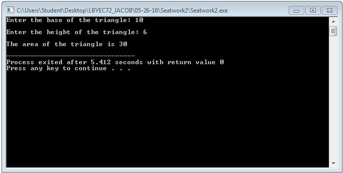

# Activity1-JacobL

##Seatwork1
```
#include <stdio.h>
#include <stdlib.h>

int main(int argc, char *argv[]) 
{
	printf("@@@@@@@@@@@@@@@@@@@@@@@@@@@@@@@@@@@@@\n\n");
	printf("\tLanz Harvey M. Jacob\n");
	printf("\t\tBS ECE\n\n");
	printf("@@@@@@@@@@@@@@@@@@@@@@@@@@@@@@@@@@@@@\n");
	return 0;
}
```


##Seatwork2
```
#include <stdio.h>
#include <stdlib.h>

int main(int argc, char *argv[]) 
{
	int base, height, area;
	
	printf("Enter the base of the triangle: ");
	scanf("%d", &base);
	printf("\n");
	
	printf("Enter the height of the triangle: ");
	scanf("%d", &height);
	printf("\n");
	
	area=base*height;
	printf("The area of the triangle is %d\n", area);
	
	return 0;
}
```


##Seatwork3
```
#include <stdio.h>
#include <stdlib.h>

int main(int argc, char *argv[]) 
{
	int year, age;
	
	printf("Enter your birth year: ");
	scanf("%d", &year);
	
	age=2016-year;
	
	printf("You are %d years old.\n", age);
	
	return 0;
}
```


##Seatwork4
```
#include <stdio.h>
#include <stdlib.h>

int main(int argc, char *argv[]) 
{
	float x, y;
	
	printf("Input the value of x: ");
	scanf("%f", &x);
	
	y=x/70;
	
	printf("f(x) is equal to %.2f",y);
	
	return 0;
}
```

